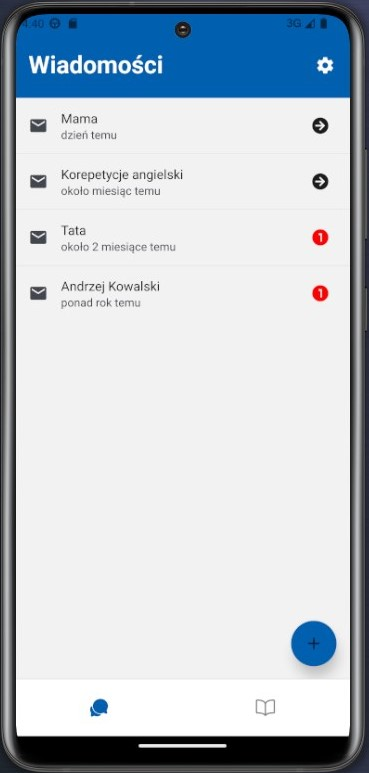

# BSc thesis project - encrypted mobile communicator app using SDEx encryption method



The thesis and app UI is in Polish, logs and comments in code are in English.

## Core functionalities

- signing/registration in app (locally)
- signing in to server (my implementation, no 3rd party)
- CRUD operations on contacts
- sending/receiving text messages
- checking user's availability
- encryption/decryption done locally, server only mediates the exchange and returns delivery confirmation

## How to run

### Mobile app (in Android emulator)

```shell
cd <PROJECT_ROOT>/sdex-encrypted-communicator
npm install
npm start
```

next press <a> to open in an avd (needs to be created beforehand)

### Server

```shell
cd <PROJECT_ROOT>/server
uvicorn main:app --reload
```

## Tech stack

### Mobile app

- React Native
- TypeScript
- Expo
- Zustand
- SQLite

### Server

- Python 3.10
- FastAPI
- Uvicorn
- Pydantic
- SQLite

App has only been tested on Android emulators and physical device, iOS hasn't been tested.
